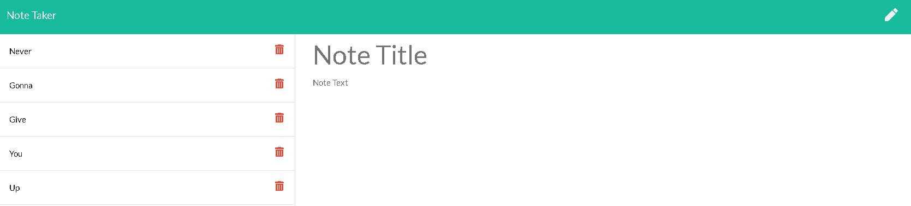

# notetaker

## Project Title

notetaker

## Project Link

- https://github.com/jamesrowe1/notetaker
- https://notetaker-james-rowe.herokuapp.com/

## Screenshot

## Getting Started

Follow the above provided heroku link. This will take you to the main note taking page. You can then "Get Started" by clicking the button of the same name. This will take you to the note taking page. Fill in the area titled "Note Title" with the title of the note you are making, and where it says "Note text", fill in all the additional information. You can then click the save button in the upper right hand corner to save the note.

On the left side will be all the notes you have already made. Just click on the title of the note to view it. Alternatively, if you no longer need the note, click the trash can to delete the note. Please note that more recent notes are found at the top of the list.

If you want to create a new note, simply click the pencil in the top right corner.

## Prerequisites

You must have a working web browser.

## Built With

- Visual Studio Code
- JavaScript
- Node
  - File system ("fs")
  - path
  - body-parser
- NPM
  - express js
- Code hosted by Github
- App hosted by Heroku

## Authors

James Rowe

## License

Licensed under Awesome Coding L.L.C. (not a real company)

## Troubleshooting

For any issues contact James Rowe

## Acknowledgments

- Ben Wright
- Justin Pinero
- Wilson Linares
